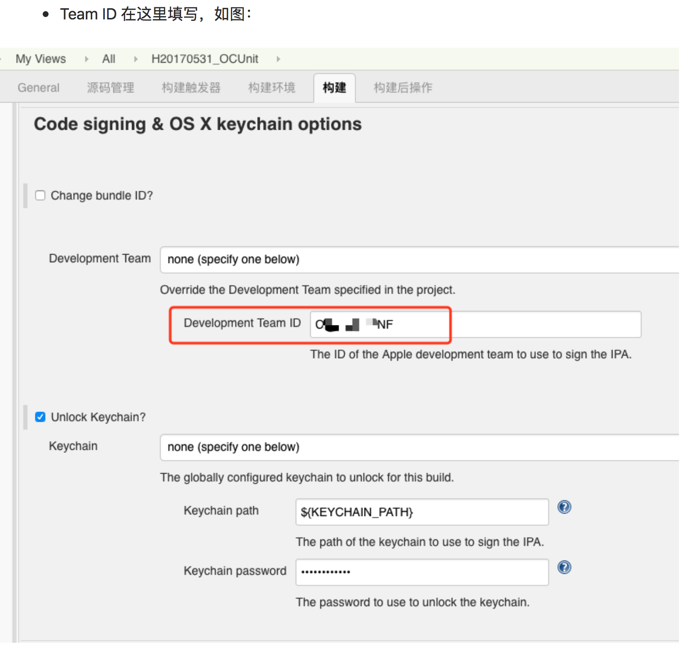
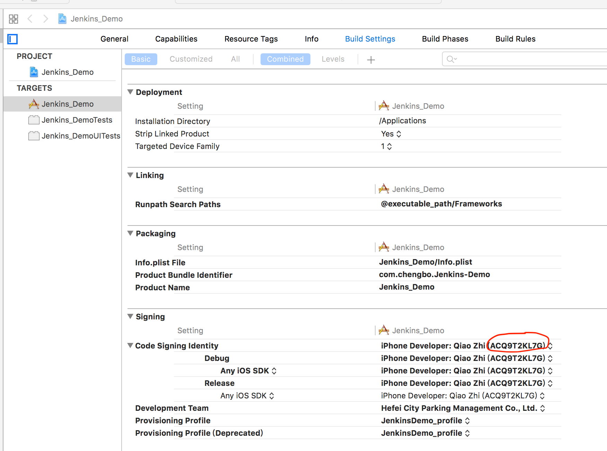

###  Jenkins 使用过程中遇到的坑
**一. FATAL: No global development team or local team ID was configured.**

Team ID 应该填写这串字符,如图

**二. The project named "Jenkins_Demo" does not contain a scheme named "Jenkins_Demo". **

  在新的打包命令中，有指定scheme参数，按照提示，在项目的xcode工程目录输入xcodebuild -list,发现有Jenkins_Demo这个scheme，而且直接xcode打包没问题.
  但是在打包机的工程目录查看scheme，发现没有Jenkins_Demo这个scheme，后来经过查询得知，需要打开工程->Product->Scheme->Manage Schemes，把要打包的scheme的shared属性勾上（如果没有对应的scheme，点击右上角的Autocreate Schemes Now自动生成对应的scheme），这时会在xcodeprj文件夹xcshareddata目录中生成ACTGame.xcsheme文件，把这个文件提交到打包机，问题解决。

	
