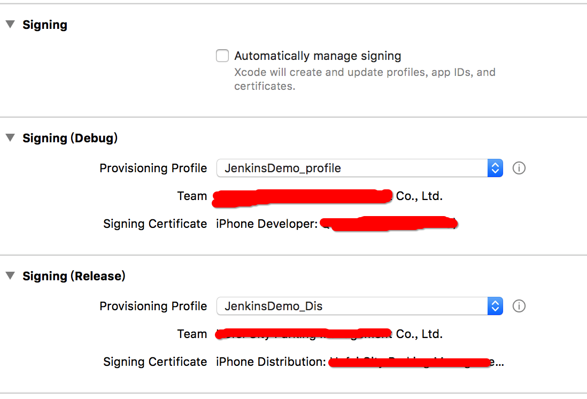

##持续集成(Continuous Integration) 
**说明: iOS的持续集成一定要在Mac上进行**
### 第一种方式: Jenkins(本地) + GitHub + 蒲公英

#### **Jenkins 本地安装**
使用brew 进行安装  [Homebrew](https://brew.sh)

`默认已经安装好brew了,下面开始操作了`

##### 一.Jenkins命令行安装
 
-   在终端输入命令行 `brew install Jenkins`, Jenkins 基于java环境,所以命令执行后,可能会看到

	```
	Jenkins: Java 1.7+ is required to install this formula.
	JavaRequirement unsatisfied!
	
	You can install with Homebrew-Cask:
	  brew cask install java
	```
* 然后根据提示 在终端中输入 `brew cask install java` ,安装过程需要输入Mac登录密码
 
* 安装java环境完成之后,提示 `🍺  java was successfully installed!`

* 安装java成功之后,重新执行 `brew install Jenkins`, 即可.等待完成
* 结束以后,默认端口8080,可以通过在终端输入, `open/usr/local/Cellar/Jenkins` , 命令查看是否安装成功

* 安装完成之后,运行 Jenkins 客户端

* 安装完成后打开终端输入命令行：`cd /usr/local/Cellar/Jenkins/版本号/libexec` , 接着再输入命令行： ` java -jar ./Jenkins.war`,    此时终端就会打印出一些日志，不用理会终端，也不要关闭

* 查看终端输入内容 `Jenkins is fully up and running` 看到这句话表示,表示安装好了,下面进入配置阶段


##### 二.Jenkins配置
 

* 打开网址 [localhost:8080](http://localhost:8080/login?from=%2F). 第一次打开,会进入到初次登录页面 
* 按照提示进入到路径文件夹下获取密码即可,也可以从刚刚终端输出位置找到默认密码即可 `/Users/用户名/.Jenkins/secrets/initialAdminPassword` 

 
 后续步骤入下
 
 
 安装过程保证网络良好,如果卡着不动了,参考下面一个朋友的解决办法.

* 就在上图所示的这一步下载的时候，基本上最后肯定有几个插件没有下载好，然后就停在这里不动了，不管怎么都不动，然后关机重启,重新进入.wars所在的文件路径，在终端执行`java -jar Jenkins.war --httpPort=8888`命令才能在输入`http://localhost:8888`后能登录Jenkins登录界面，才跳到下图所示的管理员用户注册页面

 
 然后就是常规注册,不表!
 
##### 三.Jenkins 插件安装
- 登陆后 -> 系统管理 -> 管理插件 -> 可选插件, 搜索需要的插件,选中之后拖到底部,点击安装
 
	
	
	

	安装下列插件,拖到底部,安装所选插件,(有时候会卡主,需要手动刷新), 也可以选择自动一段时间后刷新页面即可
	
	```
	GitLab plugin
	- Gitlab是一个用于代码仓库管理的开源项目,用来在Jenkins上管理源代码
	- 当git上的代码被提交 / 创建一个合并请求 / 现有合并请求关闭/合并时, 
	- GitLab 会记录构建状态,然后触发Jenkins,将Git上代码获取到Jenkins 上
	
	Gitlab Hook Plugin(这个是自动触发钩子)
	- 我觉得这一个和上面没啥区别,都是当GitHub 上传代码状态发生变化时,触发响应
	
	Xcode integration 	
	- Xcode 编译插件,相当于将Xcode的编译过程的命令行操作,通过界面化展示了出来,Jenkins 调用本地Xcode进行编译,相当于讲一个Xcode 装在了Jenkins上

	Credentials Plugin
	- 管理证书插件
	
	Keychains and Provisioning Profiles Management  
	- 钥匙串开发者证书 及 项目描述文件
	```
	
- 安装完成后 -> 系统管理 -> Keychains and Provisioning Profiles Management (如果没有的话,查看上一步,安装Keychains and Provisioning Profiles Management插件)


> 这个地方需要注意,需要上传两个文件,一个是钥匙串 keychains 文件(用于打开钥匙串中的相应的开发证书),一个是项目所需的描述文件(可以将生产描述文件 和 开发描述文件都传上去) 
	


> 上传到Jenkins上的钥匙串需要输入密码, 上传的描述文件,需要指定一个存放路径,路径自己指定,Jenkins能找到就行
> 
> 钥匙串的开发证书名称获取: `钥匙串 -> 找到对应开发证书 -> 右键显示简介 -> 细节 -> 常用名称就是我们需要的证书完整名称了`,填入到上图对应位置即可


> 描述文件,就是我们从苹果开发者网站下载的,UUID就是证书的标识,系统会自动识别,不需要手动输入
> 
> 设置完毕之后点击保存即可,需要注意的是,两个上传操作最好分开进行,因为上传另一个时,之前输入的内容可能会消失,这个地方需要注意下,好好检查下,是否输入完毕.


##### 三.项目创建


- 点击Jenkins主目录下的新建按钮,进到新建项目页面,输入项目名称,选择构建一个自由风格的软件项目


- 创建完毕之后,可以在Jenkins主界面,看到项目,点击进入项目,在左侧选项栏中,选择配置,进入配置界面
- 在构建步骤,需要添加脚本和xcode设置,后面会讲


> 构建新版本时,之前的ipa如果想保留,可以设置ipa包名称按照时间戳命名
> 
> Git设置,Credentials相当于告诉GitLab插件,GitHub账号和密码,在自己的电脑上一般不用设置,需要设置的话,可以设置账号和密码,也可以上传密钥方式
> 
> 当前打包触发方式,需要自己设置,我这里没有设置,可以定时,或者安装githook插件
> 
> 构建环境中钥匙串和描述文件,一般在第一次设置时,会不显示我们之前上传的钥匙串和描述文件内容,保存退出,再次进入一次就可以了
> 
> Git上只有podfile文件,没有将pods文件上传上去,所以要执行一个脚本更新一下,pod:`添加构建步骤 -> Execute shell`,需要放到最前,因为pods要在编译前就添加

```
#!/bin/bash -l
export LANG=en_US.UTF-8
export LANGUAGE=en_US.UTF-8
export LC_ALL=en_US.UTF-8
echo ++++++++++++++++++++++++++++++++++
pod install --verbose --no-repo-update
echo ++++++++++++++++++++++++++++++++++
```

> 
> 添加xcode运行步骤,需要注意的是:如果项目使用pods需要设置scheme和xcworkspace 同名
> 
> 在`Code signing & OS X keychain options`步骤,要输入`Development Team ID`这个就是开发证书编号,就是我们在描述文件和钥匙串上传的那个开发证书最后几位数字
> 
> 打包成功之后,将ipa上传到蒲公英是一个不错的选择,需要ukey和apikey,[蒲公英](https://www.pgyer.com/doc/view/jenkins_ios) 

```
#蒲公英上的User Key
uKey="你的ukey,蒲公英获取"
#蒲公英上的API Key
apiKey="蒲公英获取"
#执行上传至蒲公英的命令
echo "++++++++++++++upload+++++++++++++"
curl -F "file=@/Users/用户名/.jenkins/workspace/Jenkins_Demo/build/Jenkins_Demo.ipa" -F "uKey=${uKey}" -F "_api_key=${apiKey}"  http://www.pgyer.com/apiv1/app/upload
echo http://www.pgyer.com
```

> 在本地项目提交到Git时,项目中最好设置好项目配置,什么证书啊,描述文件啊,等等,因为Jenkins的打包代码是你提交的代码,我们应该按照打包的设置设置好,然后提交.Jenkins相当于一个运行脚本和记录的平台,打包环境的配置还是要自己来的
> 
> 准备工作完成以后,点击保存,回调项目目录,进行构建




> 这个可以通过通过终端,cd到项目路径下, xcodebuild -list ,查看当前项目是否有schemes(一个workspace可以包含多个project,一个project可以包含多个target，Scheme包含了所有的target集合,用于指定一个应用),如果没有的话,需要到 `Product --> Scheme --> Manage Schemes ` 找到和项目同名的scheme
> 
>shared打开,使得Jenkins也可以进行调用编译


##### 三.运行Jenkins项目

- 配置完成以后,回到项目页面点击立即构建,构建当前项目.


- 构建过程


- 打包完成之后,将ipa包上传到蒲公英上,蒲公英会给注册手机发送短信,当然你也可以在Jenkins中加入邮件通知,通过邮件获取结果


- 关于Linux下Jenkins管理iOS代码的问题,可以参考这篇[文章](http://www.jianshu.com/p/70982c43c3d1),当然你也可以问我,后续有时间在写吧,坑还是很多的

###### 写在最后: 
当你看到 `Finished : SUCCESS`的时候,表示你已经成功了,在成功的路上,试验了很多次,记得看到一个简友说他试了40多次.从不知道Jenkins是啥,一步步的走来,一个个坑,一个个踩,成功了,却觉得理所当然.希望你可以成功.有问题和错误欢迎留言!


**参考文章,相信你看完一定会有收获**

[从零开始写个自动打包IPA脚本](http://www.jianshu.com/p/97c97c2ec1ca)

[iOS持续集成:Jenkins+GitLab+蒲公英](http://www.jianshu.com/p/3b43776ed73f)

[Project、Target、Workspace and Scheme](http://supermokey.com/2016/12/16/project-target-workspace-scheme/)

