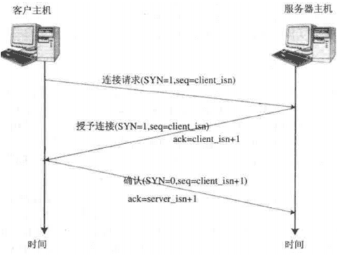
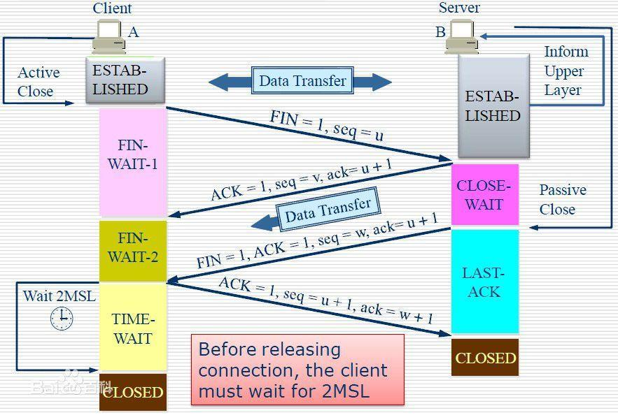

##20170626 随手笔记

###网络请求过程扫盲
[互联网协议入门一](http://www.ruanyifeng.com/blog/2012/05/internet_protocol_suite_part_i.html)

[互联网协议入门二](http://www.ruanyifeng.com/blog/2012/06/internet_protocol_suite_part_ii.html)

[DNS原理入门](http://www.ruanyifeng.com/blog/2016/06/dns.html)
>1 DNS解析
>> Domain Name System (域名系统),互联网上作为域名和IP地址**相互映射**的一个分布式**数据库**
>> 
>> MAC地址
>>> 以太网规定，连入网络的所有设备，都必须具有“网卡”接口。数据包必须是从一块网卡，传送到另一块网卡。网卡的地址，就是数据包的发送地址和接收地址，这叫做**MAC**地址
>>>
>>> 每块网卡出厂的时候，都有一个全世界独一无二的MAC地址，长度是48个二进制位，通常用12个十六进制数表示。前6个十六进制数是厂商编号，后6个是该厂商的网卡流水号。有了MAC地址，就可以定位网卡和数据包的路径了
>>>
>>>
>>> 总结:
>>>
>>> A电脑想向B电脑发送一条信息，首先A电脑要知道B电脑的MAC地址和IP地址，这其中IP地址一般是已知的，而MAC地址是未知的。这时候就需要通过ARP协议来确定B电脑的MAC地址，这其实也包括两种情况。只要拿到了电脑B的IP地址和MAC地址，两台电脑就可以通信了。
>>
>>
>> 域名
>>> 任何一个域名都对应一个或者多个ip地址，但是大部分都是一个域名对应一个ip地址。
>>>
>>> 域名系统就是储存IP地址和域名映射的一个数据库。而DNS解析，就是通过这个数据库去查找到可以使两台联网设备进行通信的IP地址的一个过程
>
> 2 HTTP请求
>> 端口
>>> 首先来说，UDP和TCP都是传输层的协议，不同点就是传输的方式不同（简单的说，后面会详细说明他们的不同点）。咱们在前面多次提到过通过IP地址和MAC地址可以建立两台电脑的“链接”，那么链接以后，应该怎样就行数据的传输呢？传输的数据是哪一个程序需要的呢（例如：同一台主机上有许多程序都需要用到网络，比如，你一边浏览网页，一边与朋友在线聊天。当一个数据包从互联网上发来的时候，你怎么知道，它是表示网页的内容，还是表示在线聊天的内容？）？于是人们发明了一个叫做“端口”的参数来区别不同程序之间的通信
>>> 
>>> **"端口"是0到65535之间的一个整数，正好16个二进制位。0到1023的端口被系统占用，用户只能选用大于1023的端口。不管是浏览网页还是在线聊天，应用程序会随机选用一个端口，然后与服务器的相应端口联系。**
>>
>> UDP 协议
>>>
>>> UDP协议简单来说就是在数据包中插入一段数据用来标记端口信息，然后将数据发送出去，至于发送出去的数据包有没有被目标设备接收到，它就不管了。以这种方式发送数据包的有点就是**简单,容易实现，但是缺点就是可靠性差**,因为通过UDP协议发送出去的数据包无法确定发送的数据包是否到达目标设备。
>> 
>> TCP 协议
>>> 而TCP协议就是为了解决UDP协议的缺点而诞生的，它虽然实现上比UDP协议复杂，但是可靠性好，可以保证数据被发送到目标设备上。
>>> 
>>> TCP发送数据三次握手
>>> 
>>>> **TCP协议是如何保证可靠性的呢？就是通过三次与目标设备的通信来确定数据包发送成功**
>>>> 
>>>> 描述大致如下 
>>>>
>>>>> 浏览器：你好服务器，我是 浏览器A
>>>> 
>>>>> 服务器：你好 浏览器A，我是 服务器B
>>>> 
>>>>> 浏览器：服务器B 你好
>>>
>>>>>
>>>
>>>>> 第一次握手：建立连接时，客户端发送syn包（syn=j）到服务器，并进入SYN_SENT状态，等待服务器确认；SYN：同步序列编号（Synchronize Sequence Numbers）。
>>> 
>>>>> 第二次握手：服务器收到syn包，必须确认客户的SYN（ack=j+1），同时自己也发送一个SYN包（syn=k），即SYN+ACK包，此时服务器进入SYN_RECV状态；
>>> 
>>>>> 第三次握手：客户端收到服务器的SYN+ACK包，向服务器发送确认包ACK(ack=k+1），此包发送完毕，客户端和服务器进入ESTABLISHED（TCP连接成功）状态，完成三次握手
>>>>
>>>> 完成三次握手，客户端与服务器开始传送数据。这样就保证了，每次传送数据都会准确到达目标设备了。
>>>> 
>>>> **相当于客户端和服务端都有一个自己的标志,服务端通过标识找到对应的客户端,双方都确认完了,才表示都准备好了**
>>>
>>> TCP四次挥手
>>>> 当数据包发送完毕需要断开连接的时候，就需要TCP的四次挥手来保证链接的合理断开。再次以浏览器和服务器的通信打比方
>>>>
>>>> 描述如下
>>>> 
>>>>> 主动结束方：你好，我的数据发送完毕了，我要进入准备断开的状态了。（此时它虽然不再发送数据了，但是可以接受数据）
>>>>>
>>>>> 另一方：我知道了，我还没有发送完毕的，你等着吧。
>>>>> 
>>>>> 另一方：我也发送完毕了，可以断开链接了。（此时它也进入准备断开的状态）
>>>>> 
>>>>> 主动结束方：好的，那断开吧。
>>>>> 
>>>>>
>>>>>
>>>>> 1.客户端A发送一个FIN，用来关闭客户A到服务器B的数据传送。
>>>>> 
>>>>> 2.服务器B收到这个FIN，它发回一个ACK，确认序号为收到的序号加1。和SYN一样，一个FIN将占用一个序号。
>>>>> 
>>>>> 3.服务器B关闭与客户端A的连接，发送一个FIN给客户端A。
>>>>> 
>>>>> 4.客户端A发回ACK报文确认，并将确认序号设置为收到序号加1。
>>>>> 
>>>>> **关闭连接也是一样的,只不过多了一步双方确认数据传输完的标志,因为有可能客服端数据传输完毕了,但是服务端未结束**
>
>
>总结
>
>到这里基本上整个网络请求的过程就结束了，你在浏览器地址框输入了域名并回车，然后通过DNS解析找到相应的IP地址；然后通过HTTP协议建立了链接，找到了目标服务器的位置；接着就是TCP三次握手建立可靠链接，发送数据，服务器处理数据，TCP四次挥手断开链接；最后浏览器根据返回的数据解析渲染呈现页面。

	
